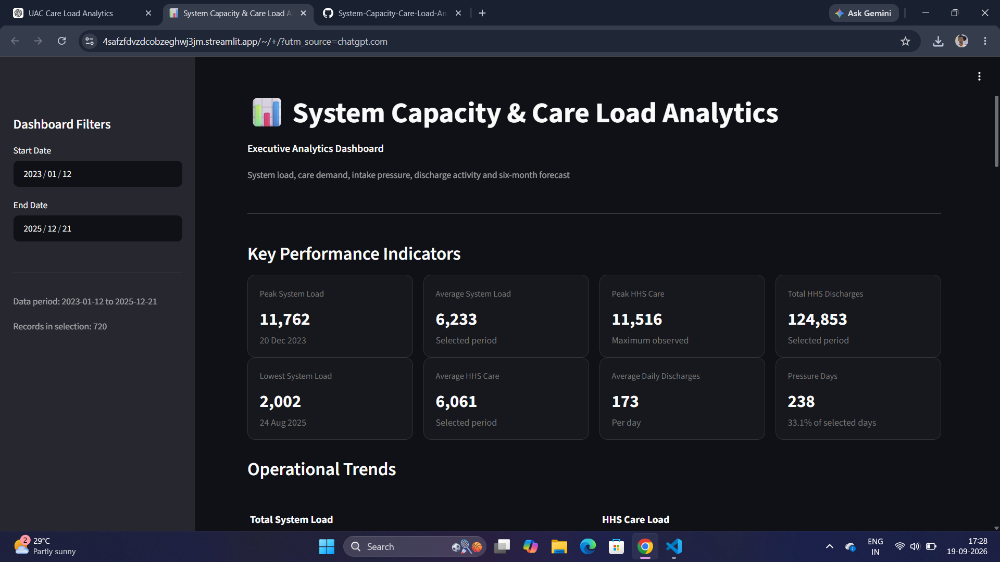
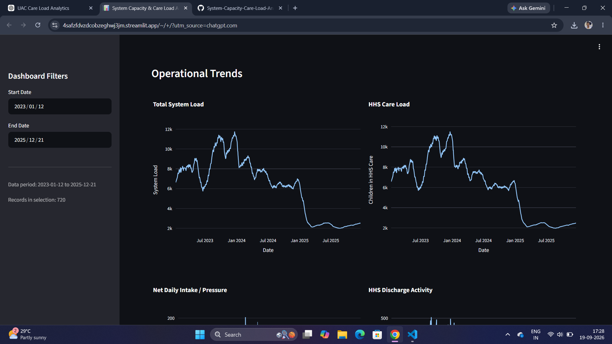
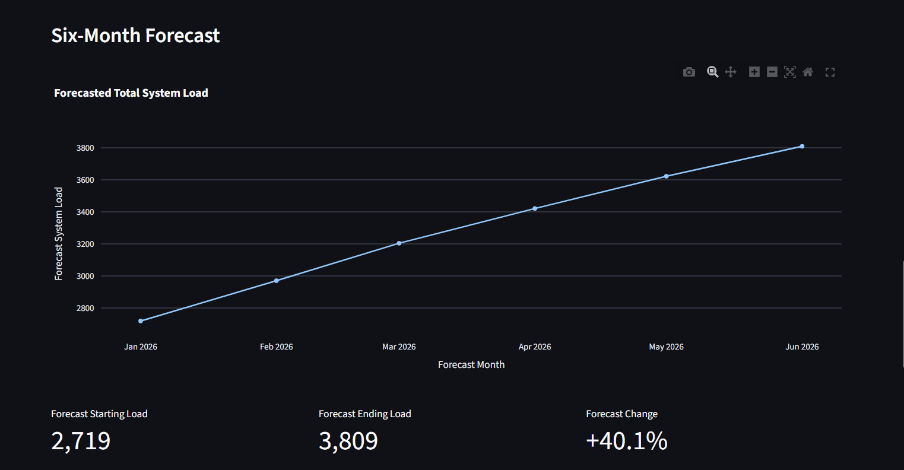

System Capacity & Care Load Analytics

End-to-end data analytics, forecasting, and Streamlit dashboard project for analyzing system capacity, care load, operational pressure, and short-term trends.

🚀 Links

Live Dashboard: https://4safzfdvzdcobzeghwj3jm.streamlit.app/

GitHub Repository: https://github.com/Roshan943985/System-Capacity-Care-Load-Analytics

📌 Project Overview

This project analyzes daily operational data across CBP custody and HHS care. The workflow covers data cleaning, validation, feature engineering, exploratory analysis, KPI development, visualization, ARIMA forecasting, and deployment as an interactive Streamlit dashboard.

🎯 Objectives

Measure total system care load.

Analyze CBP custody and HHS care trends.

Measure daily inflow/outflow balance using Net Daily Intake.

Identify high-pressure operational periods.

Compare monthly performance.

Examine relationships between operational variables.

Generate a six-month ARIMA forecast.

Communicate results through an interactive dashboard.

📊 Dataset

Records: 720 daily observations

Date range: 12 January 2023 – 21 December 2025

Core fields include Date, CBP custody, CBP transfers, HHS Care, and HHS discharges.

Derived fields include Total System Load, Net Daily Intake, Care Load Growth Rate, 7-Day Rolling Load, 14-Day Rolling Load, and Backlog Indicator.

🔎 Key Results

KPI

Result

Peak Total System Load

11,762

Peak Load Date

20 Dec 2023

Lowest Total System Load

2,002

Average Total System Load

6,232.77

Peak HHS Care

11,516

Average HHS Care

6,061.28

Total HHS Discharges

124,853

Average Daily HHS Discharges

173.41

Maximum Daily HHS Discharges

505

Average Net Daily Intake

-44.74

Pressure Days

33.06%

Highest Net Intake

206 on 12 Feb 2024

📈 Analysis

Data Cleaning & Feature Engineering

Date parsing and validation

Missing-value checks

Analytical dataset creation

Total System Load

Net Daily Intake

Care Load Growth Rate

7-Day and 14-Day rolling loads

Backlog Indicator

Pressure Analysis

Highest Net Daily Intake: 206 on 12 February 2024, with system load 8,522.

Positive intake days: 238

Negative intake days: 475

Zero intake days: 7

Pressure days: 33.06%

Correlation with Total System Load

Variable

Correlation

HHS Care

0.9995

HHS Discharged

0.9200

Transferred Out of CBP

0.7331

Apprehended / Placed in CBP

0.7100

CBP Custody

0.6900

Net Daily Intake

-0.4600

Correlation indicates association in this dataset and does not establish causation.

🔮 Six-Month ARIMA Forecast

Month

Forecast

Jan 2026

2,718.97

Feb 2026

2,970.64

Mar 2026

3,204.21

Apr 2026

3,421.01

May 2026

3,622.21

Jun 2026

3,808.96

Modelled January-to-June change: +1,089.99 (+40.09%).

🖥️ Dashboard Features

Interactive date filters

KPI cards

Operational trend charts

Pressure analysis

HHS discharge analysis

Monthly performance

Six-month forecast

Forecast metrics/table

Key insights

Dataset details

CSV download

🛠️ Technology Stack

Python • Pandas • NumPy • Plotly • Statsmodels • Streamlit • Jupyter Notebook • Git • GitHub • Streamlit Cloud

📁 Project Structure

System-Capacity-Care-Load-Analytics/
├── dashboard/
│   └── app.py
├── data/
│   └── Data_Processed/
│       ├── analytics_data.csv
│       └── 6_month_forecast.csv
├── notebooks/
├── reports/
├── README.md
├── requirements.txt
└── .gitignore

⚙️ Run Locally

git clone https://github.com/Roshan943985/System-Capacity-Care-Load-Analytics.git
cd System-Capacity-Care-Load-Analytics
pip install -r requirements.txt
streamlit run dashboard/app.py

🔄 Workflow

Raw Data
   ↓
Cleaning & Validation
   ↓
Feature Engineering
   ↓
EDA & KPI Analysis
   ↓
Pressure & Monthly Analysis
   ↓
Correlation Analysis
   ↓
ARIMA Forecasting
   ↓
Streamlit Dashboard
   ↓
GitHub + Streamlit Cloud

📷 Screenshots

Create a screenshots/ folder and add these real screenshots from the live dashboard:

Recommended captures:

Full dashboard with KPI cards.

Operational trends and pressure charts.

Monthly analysis.

Six-month forecast section.

💼 Skills Demonstrated

Python/Pandas data analysis, data cleaning, feature engineering, KPI development, data visualization, time-series forecasting, Streamlit dashboard development, Git/GitHub version control, cloud deployment, and analytical reporting.

👤 Author

Roshan Korde

Computer Science / Data Analytics Fresher

⚠️ Analytical Notes

Forecast values are model outputs and are not guaranteed future outcomes. Correlation values describe association in the supplied dataset and should not be interpreted as causal effects.
